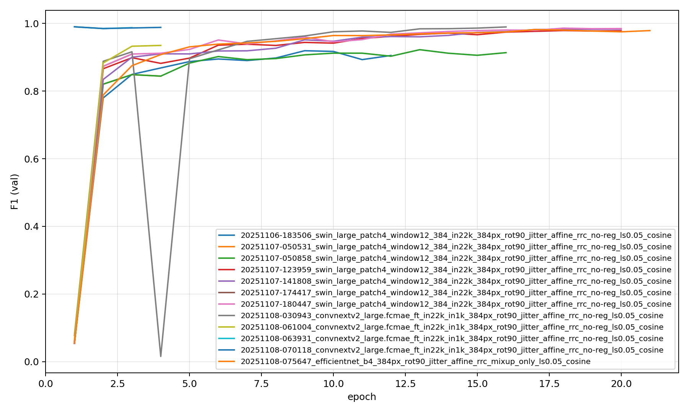
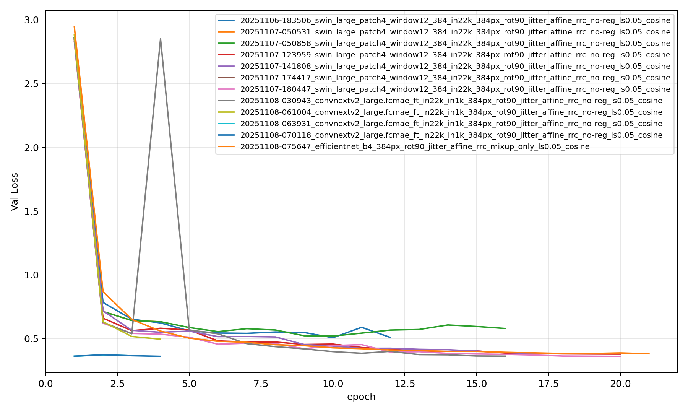
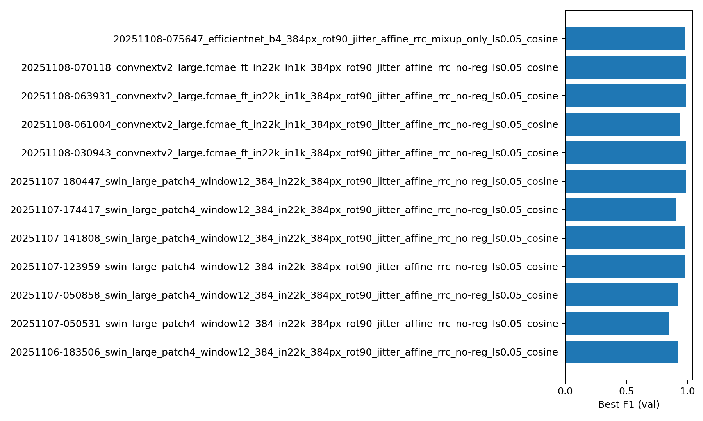

# Experiments Summary

## Charts

## Runs
- 20251108-063931_convnextv2_large.fcmae_ft_in22k_in1k_384px_rot90_jitter_affine_rrc_no-reg_ls0.05_cosine: best_f1=0.9901 @epoch 1 | final_f1=0.9875, final_val_loss=0.3668
- 20251108-070118_convnextv2_large.fcmae_ft_in22k_in1k_384px_rot90_jitter_affine_rrc_no-reg_ls0.05_cosine: best_f1=0.9901 @epoch 1 | final_f1=0.9883, final_val_loss=0.3617
- 20251108-030943_convnextv2_large.fcmae_ft_in22k_in1k_384px_rot90_jitter_affine_rrc_no-reg_ls0.05_cosine: best_f1=0.9896 @epoch 16 | final_f1=0.9896, final_val_loss=0.3629
- 20251107-180447_swin_large_patch4_window12_384_in22k_384px_rot90_jitter_affine_rrc_no-reg_ls0.05_cosine: best_f1=0.9862 @epoch 18 | final_f1=0.9849, final_val_loss=0.3610
- 20251107-141808_swin_large_patch4_window12_384_in22k_384px_rot90_jitter_affine_rrc_no-reg_ls0.05_cosine: best_f1=0.9834 @epoch 20 | final_f1=0.9834, final_val_loss=0.3812
- 20251108-075647_efficientnet_b4_384px_rot90_jitter_affine_rrc_mixup_only_ls0.05_cosine: best_f1=0.9819 @epoch 17 | final_f1=0.9789, final_val_loss=0.3816
- 20251107-123959_swin_large_patch4_window12_384_in22k_384px_rot90_jitter_affine_rrc_no-reg_ls0.05_cosine: best_f1=0.9790 @epoch 18 | final_f1=0.9783, final_val_loss=0.3789
- 20251108-061004_convnextv2_large.fcmae_ft_in22k_in1k_384px_rot90_jitter_affine_rrc_no-reg_ls0.05_cosine: best_f1=0.9350 @epoch 4 | final_f1=0.9350, final_val_loss=0.4959
- 20251107-050858_swin_large_patch4_window12_384_in22k_384px_rot90_jitter_affine_rrc_no-reg_ls0.05_cosine: best_f1=0.9224 @epoch 13 | final_f1=0.9137, final_val_loss=0.5798
- 20251106-183506_swin_large_patch4_window12_384_in22k_384px_rot90_jitter_affine_rrc_no-reg_ls0.05_cosine: best_f1=0.9194 @epoch 9 | final_f1=0.9053, final_val_loss=0.5095
- 20251107-174417_swin_large_patch4_window12_384_in22k_384px_rot90_jitter_affine_rrc_no-reg_ls0.05_cosine: best_f1=0.9095 @epoch 3 | final_f1=0.9095, final_val_loss=0.5409
- 20251107-050531_swin_large_patch4_window12_384_in22k_384px_rot90_jitter_affine_rrc_no-reg_ls0.05_cosine: best_f1=0.8486 @epoch 3 | final_f1=0.8443, final_val_loss=0.6330